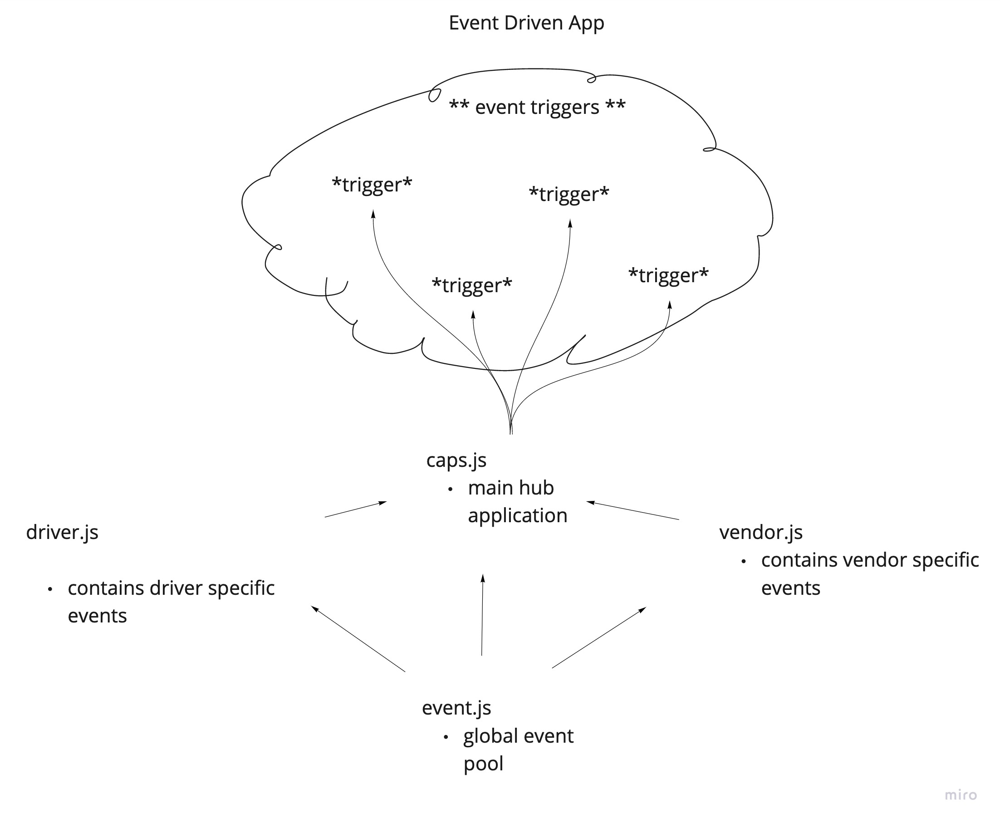

# LAB - Class 11

## Project: Event Driven Application

### Author: Jenner Dulce

### Links and Resources

- [ci/cd](https://github.com/jennerdulce/event-driven-application/actions) (GitHub Actions)
- [Pull Request](https://github.com/jennerdulce/event-driven-application/pull/1)

### Setup

#### How to initialize/run your application (where applicable)

- `node caps.js`
- `npm start`

#### How to use your library (where applicable)

#### Tests

##### Driver.js

- functions should log some output

##### Vendor.js

- functions should log some output

#### UML

;

#### Collaborations

- Mark Duenas
